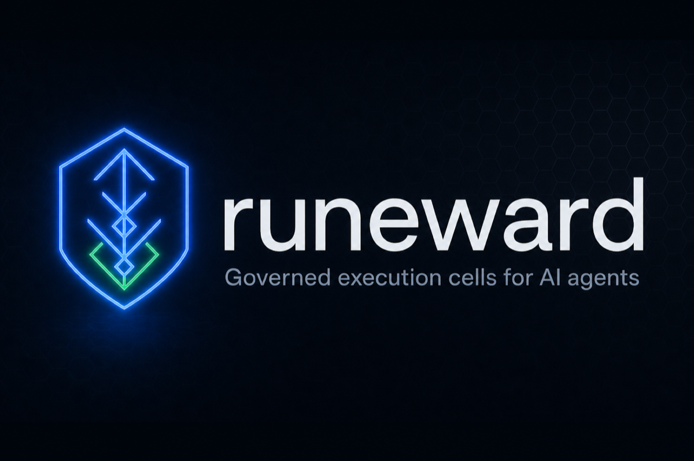

<p align="center">
  
</p>

<p align="center">
  <b>Governed execution cells for AI agents.</b>
</p>

<p align="center">
  <a href="LICENSE"></a>
  <a href="https://github.com/Runewardd/runeward/actions/workflows/ci.yml"></a>
  <a href="go.mod"></a>
  <a href="https://github.com/Runewardd/runeward/releases"></a>
</p>

<p align="center">
  Declarative profiles provision isolated sandboxes (Docker or Kubernetes) with deny-by-default
  egress, a tamper-evident audit ledger, human-in-the-loop policy gates, and cost/loop guardrails,
  driven over REST, MCP, a CLI, and a web dashboard.
</p>

## Why runeward

Letting an AI agent run shell commands, edit files, install packages, and hit the network is useful
right up until it `rm -rf`s the wrong directory, exfiltrates a secret, or burns your API budget in a
retry loop. Raw isolation ("jail the agent in a box") is table stakes. runeward adds the governance
layer *around* the box that most sandboxes lack. Think of it as a seatbelt and flight recorder for
autonomous agents.

The core idea: **don't rely on training or prompting the model to behave — enforce the rules outside
it, in a deny-by-default contract the agent can't talk its way past.** So the agent never has to
*know* it's about to break a rule; the enforcement layer knows and refuses. That also fixes the
scariest failure mode — a control the operator *forgot* to ask for — because anything the profile
didn't grant is already denied. See [Why governance, not training](https://runewardd.github.io/runeward/why-governance/).

- **Profiles are a security contract.** `[host]`, `[network]`, `[[env]]`, `[[file]]`, `[[policy]]`,
  and `[limits]` declare exactly the access a task needs. Everything you didn't grant is denied by
  default, so the blast radius is explicit.
- **Governed, not just isolated.** Every action flows through one path (policy, approval gate,
  guardrails, backend exec, audit ledger) whether it arrives via REST, the dashboard, or MCP.
- **Tamper-evident by construction.** An append-only, hash-chained, ed25519-signed ledger records
  every call and its verdict, and exports as an independently verifiable transcript.
- **Human-in-the-loop where it matters.** Per-action `allow` / `deny` / `require-approval` verdicts
  pause risky operations for an operator instead of guessing.
- **Cost and loop guardrails.** Hard caps on wall-clock, exec count, egress requests, and
  token/spend budgets, plus retry-loop detection, stop runaway agents.
- **Authenticated, multi-user control plane.** `serve` binds loopback by default and requires a
  bearer token before it will listen on a public interface; optional multi-principal RBAC scopes each
  token to specific profiles and approval rights, and the dashboard has an interactive login with
  per-user sandbox views.
- **Pluggable backends.** A Docker/Podman backend for zero-setup laptop use, or a Kubernetes backend
  (with strict L3 egress, CRDs, an admission webhook, and PSA + NetworkPolicy multi-tenancy) for
  production and fleets. Everything above the backend is identical.
- **Isolated workspaces from your real code.** `copy_from` seeds a sandbox with a copy of a local
  folder (never a mount), and `runeward export` pulls results back out, so the agent works on your
  project without ever touching the original.

### How it compares

|                                    | typical agent sandbox | runeward                                     |
| ---------------------------------- | --------------------- | -------------------------------------------- |
| Isolation (container/VM)           | yes                   | yes (Docker or Kubernetes)                   |
| Deny-by-default network egress     | sometimes             | yes; SNI allowlist, strict L3 on k8s         |
| Per-action policy + approvals      | rare                  | yes; builtin / CEL / OPA-Rego + HITL gates   |
| Tamper-evident, signed audit trail | rare                  | yes; hash-chained + ed25519, verifiable      |
| Cost / loop guardrails             | rare                  | yes; wall-clock, exec, egress, token/spend   |
| Multi-agent fleets                 | rare                  | yes; N cells + atomic task board             |
| Control-plane auth + multi-user    | rare                  | yes; bearer token + RBAC + per-user views    |
| Agent-native surface               | partial               | REST + MCP + CLI + dashboard + SKILL/adapters|

## How runeward fits your agent stack

There are two ways to put an agent behind runeward:

1. **As an MCP server for your IDE/agent (Cursor, Claude Desktop, VS Code).** Point the tool at
   `runeward mcp`; its agent then runs shell/code/file/browser tools inside a governed sandbox
   instead of on your host. Isolation, policy, egress, and audit apply to everything it does.
2. **By running an agent CLI inside the sandbox (Codex, Cursor CLI, Claude Code).** A profile ships
   the agent binary in the image and injects its API key; you launch the agent with a single governed
   exec call (or a whole fleet of them). See [Running agents and fleets](#running-agents-and-fleets).

## Quick start

Install the latest release (macOS/Linux/Windows CLI, amd64/arm64):

```bash
curl -fsSL https://raw.githubusercontent.com/Runewardd/runeward/main/install.sh | sh
```

Or with Homebrew (once the tap is published):

```bash
brew install Runewardd/tap/runeward
```

<!-- TODO: add a short demo at docs/assets/demo.gif and embed it here -->

Prefer to build from source:

```bash
# Build the single binary
go build -o bin/runeward ./cmd/runeward

# Inspect a profile's resolved, secret-redacted policy before using it
./bin/runeward --config-dir examples print ns-auto

# List reachable profiles
./bin/runeward --config-dir examples list

# Step into a sandbox interactively (needs Docker/OrbStack running)
./bin/runeward --config-dir examples dev

# Run a single command in a fresh sandbox, then tear it down
./bin/runeward --config-dir examples dev -- uname -a

# Start the governed control plane (REST API + web dashboard) on :8080
./bin/runeward --config-dir examples serve
```

Open [http://localhost:8080](http://localhost:8080) for the dashboard: pick a profile, click **New**
(optionally point it at a local folder to copy in), and drive the sandbox's terminal, files, shell,
audit timeline, and approvals inbox.

## Working against your own code

runeward never mounts your host folder into the sandbox. Instead it takes a one-time copy at create,
so the agent works on an isolated `/workspace` and your real files are never modified. There are
three ways to seed it.

**1. In a profile** with `host.copy_from`:

```toml
[host]
type      = "container"
image     = "runeward-agent:dev"
workdir   = "/workspace"
copy_from = "~/Documents/my-project"   # contents copied into /workspace at create
```

**2. Per-create over REST or the dashboard**, overriding it for a single sandbox:

```bash
curl -sX POST localhost:8080/v1/sandboxes \
  -d '{"profile":"codex-agent","copy_from":"~/Documents/my-project"}'
```

The dashboard's New dialog has an optional "Copy local folder into workspace" field.

**3. Pull results back out** to a host directory (the sandbox is only read; later host edits never
flow back in):

```bash
./bin/runeward export <sandbox-id> ./agent-output      # works for Docker and Kubernetes cells
```

Snapshots (`POST /v1/sandboxes/{id}/snapshot`) are the other way to preserve or fork a workspace.

## Running agents and fleets

Build the agent image once (it ships `codex`, the Cursor CLI (`agent`), Claude Code (`claude`), git,
python, node, and `tar`):

```bash
docker build -f deploy/Dockerfile.agent -t runeward-agent:dev .
```

### Codex (OpenAI)

```bash
printf '%s' "$OPENAI_API_KEY" > ~/.runeward-openai.key   # key read at launch, redacted from ledger
./bin/runeward --config-dir examples serve

# create the governed cell, then run the agent inside it
SB=$(curl -sX POST localhost:8080/v1/sandboxes -d '{"profile":"codex-agent"}' | jq -r .id)
curl -sX POST localhost:8080/v1/sandboxes/$SB/shell/exec -d '{"command":["sh","-lc",
  "codex exec --skip-git-repo-check --dangerously-bypass-approvals-and-sandbox '\''write fib.py and run it'\''"]}'
```

`--dangerously-bypass-approvals-and-sandbox` is correct here: runeward is the external sandbox.
`codex exec` authenticates from `CODEX_API_KEY`, so [examples/codex-agent.toml](examples/codex-agent.toml)
injects both `CODEX_API_KEY` and `OPENAI_API_KEY` from the same key file. Only `api.openai.com` is
reachable; everything else is denied.

### Cursor CLI

```bash
printf '%s' "$CURSOR_API_KEY" > ~/.runeward-cursor.key
SB=$(curl -sX POST localhost:8080/v1/sandboxes -d '{"profile":"cursor-agent"}' | jq -r .id)
curl -sX POST localhost:8080/v1/sandboxes/$SB/shell/exec -d '{"command":["sh","-lc",
  "agent -p '\''write fib.py and run it'\'' --force --trust --output-format text"]}'
```

See [examples/cursor-agent.toml](examples/cursor-agent.toml). The Cursor CLI is Node-based, so the
profile sets `NODE_USE_ENV_PROXY=1` to route it through runeward's cooperative Docker egress proxy;
only Cursor's endpoints are allowed.

### Claude / Cursor / VS Code (via MCP)

For IDE agents, expose runeward's governed tools over MCP and let the IDE drive sandboxes:

```jsonc
// e.g. Cursor .cursor/mcp.json or Claude Desktop config
{ "mcpServers": { "runeward": { "command": "runeward", "args": ["mcp", "--config-dir", "examples"] } } }
```

The agent then calls `runeward_create_sandbox` (which accepts an optional `copy_from`),
`runeward_shell`, `runeward_python`, `runeward_read_file`, `runeward_browser_*`, and so on, all
governed.

### Fleets (many agents, one task board)

A fleet is N identical governed cells sharing an atomic, concurrency-safe task board. Set the replica
count and per-agent model/prompt in the profile ([examples/codex-fleet.toml](examples/codex-fleet.toml),
[examples/cursor-fleet.toml](examples/cursor-fleet.toml)):

```toml
[fleet]
replicas = 3
```

```bash
FL=$(curl -sX POST localhost:8080/v1/fleets -d '{"profile":"codex-fleet"}' | jq -r .id)
curl -sX POST localhost:8080/v1/fleets/$FL/tasks  -d '{"payload":"refactor module A"}'
curl -sX POST localhost:8080/v1/fleets/$FL/claim  -d '{"owner":"w1"}'   # atomic claim by a worker
```

Dead workers' claims auto-requeue via leases, and the board survives restarts. Pin the model per
agent by baking it into the profile's launch command (e.g. `codex exec -m o3` or `agent --model ...`).

**Coordination model.** Agents do not talk to each other directly. Each sandbox is isolated (its own
container/pod, workspace, and deny-by-default egress), so one agent cannot reach another unless you
explicitly allowlist it. Instead, workers in a fleet coordinate through the shared task board via the
control plane (claim / complete / fail), which keeps every interaction atomic and audited. Separate
fleets each have their own board and are fully isolated from one another.

### Prompt-driven fleets: any agent, multiple keys, local LLMs

[examples/build-fleet.toml](examples/build-fleet.toml) (Docker) and
[examples/build-fleet-k8s.toml](examples/build-fleet-k8s.toml) (Kubernetes) are prompt-driven fleets:
the board starts empty and you push prompts at runtime. Both wire in keys for all three agents at
once and `serve` simply skips any key file that doesn't exist, so you keep only the key(s) you use.
The `runeward fleet` subcommand drives either one against a running `serve`; pick the agent with
`--agent cursor|codex|claude` and the model with `--model` (both also read `$AGENT` / `$MODEL`):

```bash
printf '%s' "$ANTHROPIC_API_KEY" > ~/.runeward-anthropic.key   # plus openai/cursor keys as needed
./bin/runeward --config-dir examples serve

./bin/runeward fleet --agent claude --model sonnet build "Build a FastAPI todo API with tests"
```

Two ways to work. Each worker has its own `/workspace`, so it matters whether follow-ups land on the
same one.

**A) Iterate on one app** (same workspace accumulates) with `exec`, which pins to a single sandbox.
This is the "pass a prompt, then keep adding prompts/changes" flow:

```bash
runeward fleet --agent claude --model sonnet up
runeward fleet exec "Build a FastAPI todo API in app/ with SQLite and pytest"
runeward fleet exec "Now add a PUT /todos/{id} endpoint and tests for it"   # same code
runeward fleet exec "Add a Dockerfile and a README"
runeward fleet export ./out                                                 # pull results to the host
```

Switch agent/model any time via the flags, e.g.
`runeward fleet --agent codex --model gpt-5-codex exec "refactor the routes"`.

**B) Fan out independent pieces** across the fleet (parallel) with `add` + `run`; each prompt goes to
whichever worker is free, in its own workspace:

```bash
runeward fleet --agent codex up
runeward fleet add "Build the auth module in auth/ with tests"
runeward fleet add "Build the billing module in billing/ with tests"
runeward fleet add "Build the CLI in cmd/ with tests"
runeward fleet run          # all workers build in parallel
runeward fleet export ./out # out/<sandbox-id>/... — assemble the pieces
```

For Kubernetes, the same command drives `build-fleet-k8s` unchanged (`runeward fleet up build-fleet-k8s`);
`serve` reads the key files locally and injects them into every Pod. A dependency-free bash equivalent
lives at [examples/fleet.sh](examples/fleet.sh) if you'd rather script it with `curl`/`jq`.

**Local LLMs.** runeward isn't tied to those cloud CLIs; it governs whatever command you exec, so any
local-model runner works too. Point Codex (or `aider`) at an OpenAI-compatible endpoint via
`OPENAI_BASE_URL` and allow just that host: on Docker that's `host.docker.internal` (Ollama, LM
Studio, vLLM, llama.cpp); on Kubernetes, run the model as an in-cluster Service and allow its DNS
name, or run it *inside* the pod with `network.default = "deny"` and no allow rules for a fully
air-gapped, still-audited fleet. (Cursor's `agent` is cloud-bound and Claude Code is Anthropic-bound;
Codex and generic CLIs are the local-friendly paths.)

## Profiles

Profiles may be authored in TOML, YAML, or JSON; the file extension picks the parser and all three
share the same schema (TOML is shown throughout these docs). `runeward <name>` resolves
`<name>.{toml,yaml,yml,json}` in order:

1. `./.runeward/<name>.*`, project-local and committed with the repo.
2. `~/.config/runeward/<name>.*` (or `$XDG_CONFIG_HOME/runeward/`).

`--config-dir DIR` (or `$RUNEWARD_CONFIG_DIR`) pins the search to a single directory, used for the
sanitized templates in [examples/](examples/). See [examples/ns-auto.toml](examples/ns-auto.toml) for
a fully worked deny-by-default profile.

Secrets in `[[env]]` are resolved fresh at launch — inline `value`, `file`, or a reference URI:
`op://` (1Password), `env://`, `vault://` (HashiCorp Vault), `aws://` (AWS Secrets Manager), or
`gcp://` (GCP Secret Manager). They are injected into the session, redacted from the ledger, and
never written under `$HOME`. Resolution is fail-closed: a reference that can't be resolved aborts
sandbox creation rather than starting without the secret.

## CLI

```
runeward <profile> [-- cmd...]       Provision a sandbox for a profile and enter it (alias for enter)
runeward enter <profile>             Same, explicit; --keep leaves the sandbox running
runeward fleet <up|add|run|build|exec|status|export|down>   Drive a prompt-driven fleet (--agent/--model)
runeward export <id> <dir>           Copy a sandbox's /workspace back out to a host directory
runeward print <profile>             Show the resolved, secret-redacted profile + policy
runeward list                        List reachable profiles
runeward validate <profile>          Statically lint a profile (missing images, unresolved secrets, dead rules)
runeward policy {test,scaffold}      Simulate a profile's policy, or print a ready-made policy template
runeward profile {sign,verify}       Produce/verify a detached ed25519 signature over a profile
runeward runtime {check,guide,install}  Inspect, explain, or install hardened runtimes (gVisor/Kata)
runeward replay <cast>               Replay a recorded terminal session (asciinema v2)
runeward serve [--token ...]         Governed control plane: REST API + web dashboard (127.0.0.1:8080)
runeward mcp [--http]                Model Context Protocol server (stdio, or streamable HTTP)
runeward up [--crds-only]            Install CRDs + namespace + RBAC + controller into k8s
runeward controller                  Reconcile Sandbox/Fleet CRDs onto the k8s backend
runeward webhook                     Self-registering admission webhook for ClusterPolicy
runeward audit verify                Verify the hash chain + signatures of the ledger
runeward bundle {keygen,push,pull}   Build/publish/verify signed OCI policy bundles
```

## Control plane (REST)

`runeward serve` routes every tool call through policy, approval gate, guardrails, backend exec, and
the audit ledger, whether it arrives over REST, the dashboard, or MCP. It binds `127.0.0.1` by
default; set a bearer token with `--token` / `$RUNEWARD_API_TOKEN` (or per-principal RBAC via
`$RUNEWARD_AUTHZ_FILE`) before binding a public interface, and pass it as `Authorization: Bearer
<token>` on every request except `/healthz` and the dashboard shell.

```
GET      /healthz
GET      /metrics                           # Prometheus metrics (token-gated when auth is on)
GET      /v1/whoami                         # the caller's identity + capabilities
GET      /v1/profiles
POST     /v1/sandboxes                      {"profile":"dev","copy_from":"~/proj"}   # copy_from optional
GET      /v1/sandboxes   ·  GET|DELETE /v1/sandboxes/{id}   # scoped to the caller under RBAC
POST     /v1/sandboxes/{id}/shell/exec      {"command":["ls","-la"]}
POST     /v1/sandboxes/{id}/code/python     {"code":"print(2+2)"}
POST     /v1/sandboxes/{id}/code/node       {"code":"..."}
POST     /v1/sandboxes/{id}/file/{read,write,list,search}
POST     /v1/sandboxes/{id}/usage           {"tokens":1200,"cost_usd":0.03}   # accrues toward the budget
POST     /v1/sandboxes/{id}/snapshot        {"name":"before-refactor"}
GET      /v1/snapshots   ·  POST /v1/snapshots/{id}/restore
POST     /v1/fleets                         {"profile":"fleet-demo"}   # N cells + shared task board
GET      /v1/fleets   ·  GET|DELETE /v1/fleets/{id}
GET|POST /v1/fleets/{id}/tasks             # list / add tasks
POST     /v1/fleets/{id}/claim             {"owner":"w1"}             # atomic claim
POST     /v1/fleets/{id}/tasks/{tid}/{complete,fail}
GET      /v1/sandboxes/{id}/audit          # this sandbox's ledger events
GET      /v1/sandboxes/{id}/terminal       # interactive PTY over WebSocket (token via ?token=)
GET      /v1/audit/verify                  # verify the hash chain + signatures
GET      /v1/approvals   ·  POST /v1/approvals/{id}/{approve,deny}   # approver identity recorded
POST     /mcp                              # Model Context Protocol (streamable HTTP)
```

A denied tool call returns `403`; a require-approval call blocks until an operator resolves it via
the approvals inbox (returning `202` with an `approval_id` if it waits too long). Once a sandbox's
reported usage exceeds its profile's `limits.max_tokens`/`max_cost_usd`, further calls are denied
fail-closed. Pin the ledger and signing-key location with `$RUNEWARD_STATE_DIR`.

## Observability

`serve` and `controller` are built to run as services:

- **Metrics.** Prometheus exposition at `GET /metrics` — `runeward_actions_total{tool,verdict}`,
  `runeward_actions_duration_seconds{tool}`, `runeward_sandboxes_created_total`,
  `runeward_usage_tokens_total{profile}`, `runeward_usage_cost_usd_total{profile}`, and
  `runeward_build_info{version}`, plus the standard Go/process collectors.
- **Structured logs.** Both services log via `log/slog`. Set `RUNEWARD_LOG_FORMAT=json` for
  aggregators and `RUNEWARD_LOG_LEVEL=debug|info|warn|error` to tune verbosity.
- **Telemetry is opt-in and off by default.** It only activates when you set both
  `RUNEWARD_TELEMETRY=1` and `RUNEWARD_TELEMETRY_ENDPOINT` (and never when `DO_NOT_TRACK` is set).
  Events carry only version/os/arch — no hostnames, paths, IDs, or profile contents.

See [docs/observability](https://runewardd.github.io/runeward/observability/) for details.

Releases are signed with keyless [cosign](https://docs.sigstore.dev/) and ship SBOMs; see
[Verifying release artifacts](https://runewardd.github.io/runeward/install/#verifying-release-artifacts).

## MCP

`runeward mcp` exposes the same governed tools over the Model Context Protocol: stdio by default
(Claude Desktop / Cursor / VS Code), or `--http` for the streamable transport (also mounted at `/mcp`
by `runeward serve`).

- **Sandbox tools:** `runeward_create_sandbox` (accepts `copy_from`), `runeward_shell`,
  `runeward_browser`, `runeward_browser_open`, `runeward_browser_act`, `runeward_browser_close`,
  `runeward_python`, `runeward_node`, `runeward_read_file`, `runeward_write_file`,
  `runeward_list_files`, `runeward_search_files`, `runeward_list_approvals`, `runeward_kill_sandbox`.
- **Fleet tools:** `runeward_create_fleet`, `runeward_list_fleets`, `runeward_list_tasks`,
  `runeward_add_task`, `runeward_claim_task`, `runeward_complete_task`, `runeward_fail_task`,
  `runeward_kill_fleet`.

A policy deny surfaces as a tool error; a require-approval verdict tells the agent to pause for a human.

## Adapters

Adapters make runeward's governed tools a first-class citizen in the agent frameworks you already
use: import a small client (or a ready-made set of framework "tools") and hand them to your agent.
The agent calls `runeward_shell`, `runeward_python`, `runeward_read_file`, … like any other tool, but
every call flows through the same governed path (policy → approval → guardrails → sandbox → audit).
Each returns one of three verdicts — `allow`, `deny` ("don't retry"), or `require-approval` ("pause
for a human") — surfaced as typed errors on the raw client and as model-readable strings on the
framework tools. See [docs/adapters](https://runewardd.github.io/runeward/adapters/) and
[`adapters/`](adapters/).

**Python (`runeward`)** — pure-stdlib client; framework tools are lazy-loaded optional extras for
LangChain, CrewAI, LlamaIndex, the OpenAI Agents SDK, and Strands:

```bash
pip install runeward                    # core client only (no third-party deps)
pip install "runeward[strands]"         # a framework extra (also: langchain, crewai, llamaindex, openai-agents)
```

```python
from runeward import RunewardClient
from runeward.strands_tools import make_runeward_tools   # or langchain_/crewai_/llamaindex_/openai_agents_tools

tools = make_runeward_tools(RunewardClient("http://localhost:8080"))
# hand `tools` to your Strands / LangChain / CrewAI / LlamaIndex / OpenAI-Agents agent
```

**TypeScript (`@runeward/sdk`)** — `fetch`-based client with no runtime deps; tools use optional peers
for the Vercel AI SDK, LangChain.js, and Strands:

```bash
npm install @runeward/sdk ai zod                    # Vercel AI SDK tools
npm install @runeward/sdk @langchain/core zod       # LangChain.js tools
npm install @runeward/sdk @strands-agents/sdk zod   # Strands Agents SDK tools
```

```ts
import { RunewardClient } from "@runeward/sdk";
import { makeRunewardTools } from "@runeward/sdk/strands-tools";   // or "/ai-tools", "/langchain-tools"

const tools = await makeRunewardTools(new RunewardClient());
```

Already on an **MCP client** (Claude Desktop, Cursor, VS Code)? You don't need an adapter — point it
at `runeward mcp` (see [MCP](#mcp) above).

## Kubernetes

One command installs the CRDs and the controller into the current cluster (idempotent, server-side
apply, using your kubeconfig):

```bash
go build -o bin/runeward ./cmd/runeward
docker build -f deploy/Dockerfile -t runeward:latest .   # shared with OrbStack/Docker Desktop k8s
./bin/runeward up                                         # CRDs + namespace + RBAC + controller
# or just the CRDs:  ./bin/runeward up --crds-only

# Provide profiles the controller can resolve
kubectl -n runeward create configmap runeward-profiles --from-file=examples/
```

Or via Helm:

```bash
helm install runeward deploy/helm/runeward -n runeward --create-namespace \
  --set image.tag=latest --set server.enabled=true
```

Then drive it declaratively:

```yaml
apiVersion: runeward.dev/v1alpha1
kind: Sandbox
metadata: { name: demo, namespace: runeward }
spec: { profile: k8s }
---
apiVersion: runeward.dev/v1alpha1
kind: Fleet
metadata: { name: crew, namespace: runeward }
spec: { profile: fleet-demo }
```

```bash
kubectl -n runeward get sandboxes,fleets
```

The controller provisions the backing Pods/PVCs, populates `.status` (`sandboxId`/`fleetId`, phase,
task stats), and tears everything down via a finalizer on delete. On k8s, egress can be enforced at
L3 (`enforce = "strict"`: an iptables init container plus a transparent SNI proxy) so it cannot be
bypassed by an uncooperative process.

For multi-tenancy, the managed namespace carries Pod Security Admission labels
(`RUNEWARD_K8S_PSA_ENFORCE`, or the chart's `podSecurityStandard`), sandbox containers always drop
`ALL` capabilities and disable privilege escalation, and an optional default-deny NetworkPolicy
(DNS-only egress) isolates sandbox pods (`RUNEWARD_K8S_NETWORK_POLICY`, or the chart's
`networkPolicy.enabled`). Pair this with a hardened `runtime_class` (gVisor/Kata) — install one with
`runeward runtime install` — for VM-grade isolation of untrusted workloads.

For org-shared cells that shouldn't live in a single team's namespace, use cluster-scoped
`ClusterSandbox` / `ClusterFleet` (same spec, no `namespace`); the same controller reconciles them
cluster-wide.

### Org-wide policy defaults

A cluster-scoped `ClusterPolicy` sets org-wide guardrails on `Sandbox`/`Fleet` resources, enforced by
`runeward webhook` (a self-registering validating and mutating admission webhook that mints its own
serving cert):

```yaml
apiVersion: runeward.dev/v1alpha1
kind: ClusterPolicy
metadata: { name: org-defaults }
spec:
  allowedProfiles: ["k8s", "fleet-*"]   # globs; empty = any
  deniedProfiles: ["*-admin"]
  defaultProfile: "k8s"                  # mutating: fills empty spec.profile
  allowedNamespaces: ["team-*"]
  requiredLabels: ["owner"]
```

Enable it with the chart (`--set webhook.enabled=true`); the validating webhook is fail-closed
(`failurePolicy: Fail`) and denies resources that violate policy. The mutating defaulting path is
best-effort (`failurePolicy: Ignore`) for missing `spec.profile`.

## Policy engines

Authority is `allow` / `deny` / `require-approval` per action, chosen with `policy_engine`:

- `builtin` (default): first-match tool + glob rules (`[[policy]]`).
- `cel`: CEL expressions over `{tool, arg}` (`[[cel]]`); see `examples/`.
- `rego`: OPA/Rego module returning `data.runeward.decision` (`[rego]`); see
  [examples/rego.toml](examples/rego.toml).

Instead of embedding policy inline, a profile can pull it from a signed, versioned OCI policy bundle,
so a security team ships one artifact many profiles consume:

```toml
[policy_bundle]
ref        = "oci://ghcr.io/acme/runeward-policies:v3"
verify_key = "<base64 ed25519 public key>"   # when set, a valid signature is REQUIRED (fail-closed)
```

```bash
runeward bundle keygen --out ./keys
runeward bundle push oci://ghcr.io/acme/runeward-policies:v3 \
    --policy prod.rego --engine rego --key ./keys/bundle.key
runeward bundle pull oci://ghcr.io/acme/runeward-policies:v3 --verify-key ./keys/bundle.pub
```

The signature covers the content-addressed config and layer digests and rides in the OCI manifest
annotations; see [examples/policy-bundle.toml](examples/policy-bundle.toml).

## Testing

See [docs/E2E-TESTING.md](docs/E2E-TESTING.md) for an end-to-end local walkthrough covering the Docker
and Kubernetes backends, deny-by-default and strict egress, snapshots, multi-agent fleets, and wiring
the MCP server into Claude Desktop, Cursor, and VS Code.

## Contributing

Contributions are welcome. See [CONTRIBUTING.md](CONTRIBUTING.md) for how to build,
test, and submit changes, and [CODE_OF_CONDUCT.md](CODE_OF_CONDUCT.md) for community
expectations. Found a security issue? Please follow [SECURITY.md](SECURITY.md) and
report it privately.

## License

Licensed under the [Apache License 2.0](LICENSE). See [NOTICE](NOTICE) for attribution.
